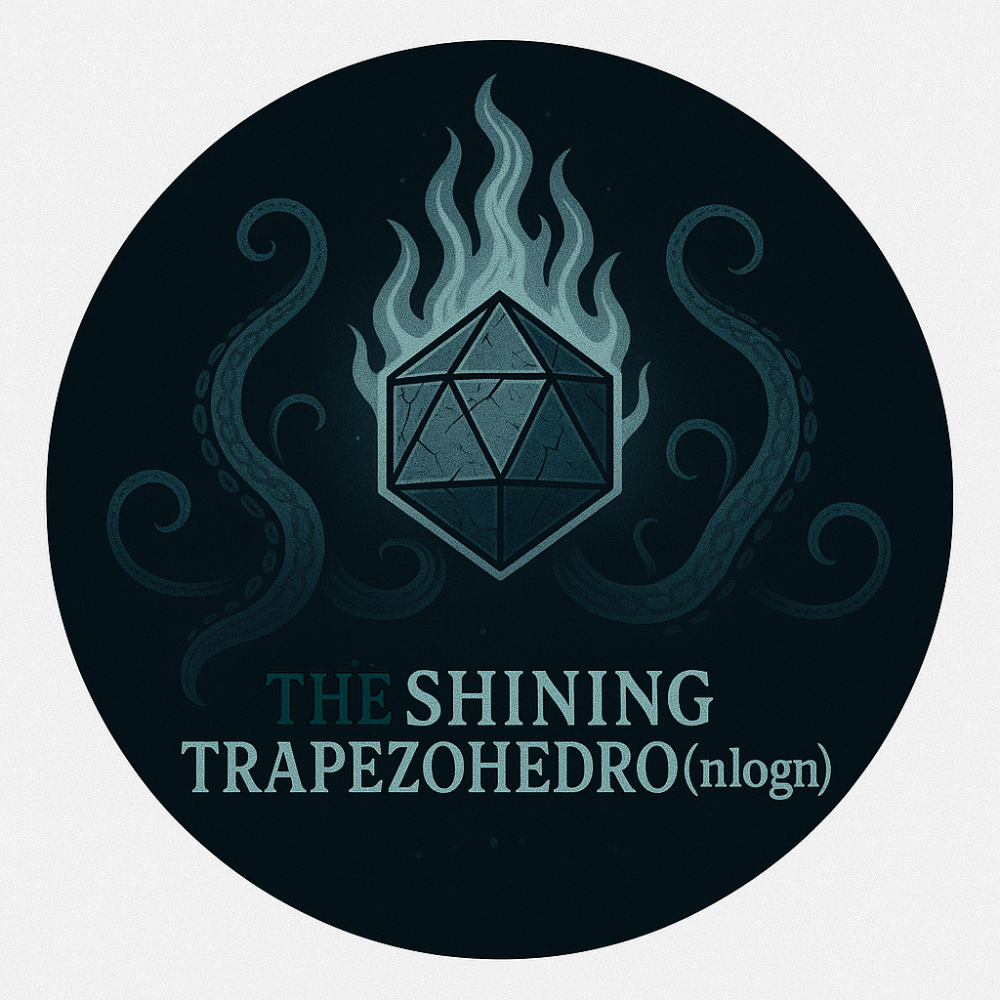

<h1 align="center">
  <br>
  <div style="width:312px; height:312px; border-radius:50%; overflow:hidden; border:4px solid #333; margin: 0 auto; display:flex; align-items:center; justify-content:center;">
      
  </div>
  <sub><i>The Shining</i></sub><br>
  <b>TRAPEZAHEDR</b><code>O(n log n)</code>
  <br>
</h1>

<h4 align="center">A repository containing personal code solutions and problem-solving notes, flavoured with mythos artifacts and log-linear algorithmic complexity.</h4>
<p align="center">
  <a href="#"></a>
  <a href="#"></a>
  <a href="#"></a>
</p>

<p align="center">
  <a href="#key-features">Key Features</a> •
  <a href="#how-to-use">How To Use</a> •
  <a href="#configuration">Configuration</a> •
  <a href="#credits">Credits</a> •
  <a href="#license">License</a>
</p>
<p>
  <i>
    “I have seen the dark universe yawning where the black planets roll without aim... The Shining Trapezohedron... blasphemous and unholy, was a window on all time and space.”
  </i>
</p>
<p style="text-align: right; margin-top: -25px;">
  - The Haunter of the Dark by H. P. Lovecraft.
</p>

## Key Features

- Personal solutions to Data Structures & Algorithms (DSA) problems
- Notes & Drawings capturing my thought process
- LeetCode problems semantically categorized by data structures

## How To Use

This repository is primarily intended for personal use but can be helpful to others as well. You can use it standalone or include it as a submodule in [`yeetcodex`](https://github.com/brunohaf/yeetcodex).

```bash
git clone git@github.com:brunohaf/trapezohedronlogn.git
```

While this repository is built for personal workflow and learning, you're welcome to explore it for inspiration, fork it, or use it as a template for your own LeetCode journey.

---

## Configuration

This setup works seamlessly with the excellent [vscode-leetcode](https://github.com/LeetCode-OpenSource/vscode-leetcode) extension — whether you're using VS Code or its cooler, telemetry-free cousin, [VS Codium](https://github.com/VSCodium/vscodium).

```json
{
  "leetcode.workspaceFolder": "${env:pwd}/solutions/leetcode",
  "leetcode.filePath": {
    "default": {
      "folder": "unsorted/${difficulty}",
      "filename": "${id}_${snake_case_name}.${ext}"
    }
  },
  "leetcode.defaultLanguage": "python3",
  "leetcode.colorizeProblems": true,
  "leetcode.hint.commentDescription": true,
  "leetcode.showDescription": "Both",
  "leetcode.allowReportData": false
}
```

## Credits

Inspired by **Lovecraftian mythos** and the beauty of computational thinking.
Named after _The Shining Trapezohedron_ from H. P. Lovecraft’s **The Haunter of the Dark**, where unspeakable knowledge comes at a terrible cost.

## License

[Apache 2.0](LICENSE)

---

> GitHub [@brunohaf](https://github.com/brunohaf)
