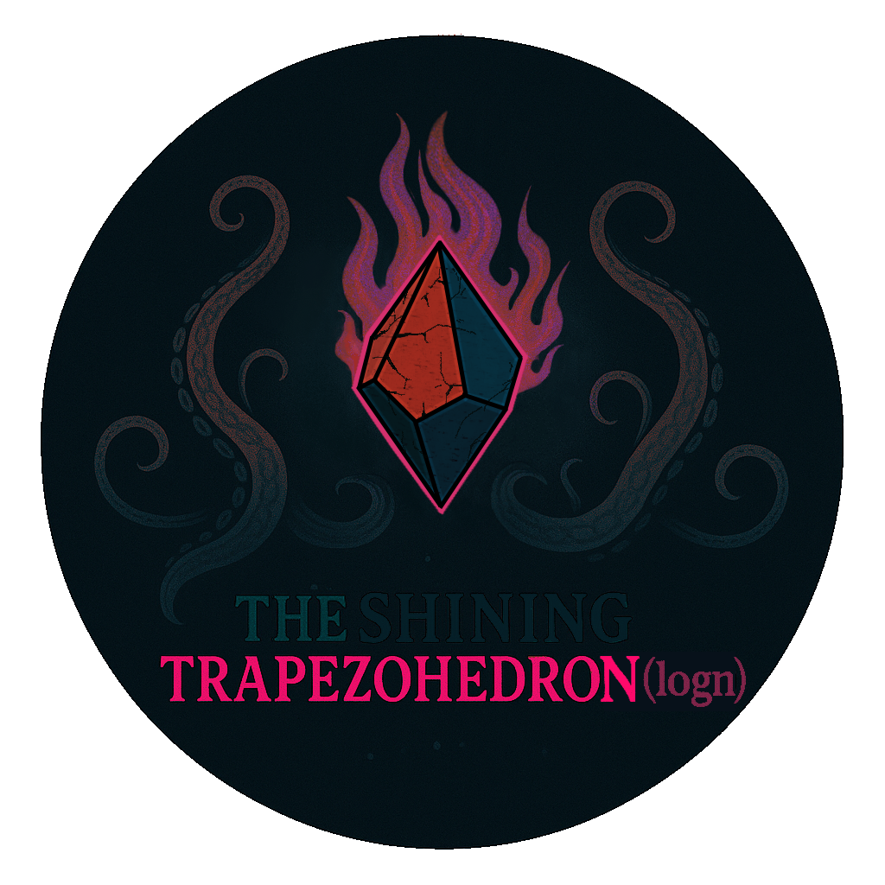

<h1 align="center">
  <br>
  <div style="width:312px; height:312px; border-radius:50%; overflow:hidden; border:4px solid #333; margin: 0 auto; display:flex; align-items:center; justify-content:center;">
      
  </div>
  The Shining Trapezohedro(nlogn)
  <br>
</h1>
<a align="center"><em>“I have seen the dark universe yawning where the black planets roll without aim...”</em> - The Haunter of the Dark by H. P. Lovecraft.<a>


<h4 align="center">A repository containing personal code solutions and problem-solving notes, inspired by mythos artifacts and algorithmic complexity.</h4>
<p align="center">
  <a href="#"></a>
  <a href="#"></a>
  <a href="#"></a>
</p>

<p align="center">
  <a href="#key-features">Key Features</a> •
  <a href="#how-to-use">How To Use</a> •
  <a href="#configuration">Configuration</a> •
  <a href="#credits">Credits</a> •
  <a href="#license">License</a>
</p>

## Key Features

* 💻 Personal solutions to DSA and LeetCode problems  
* 🧠 Detailed explanations and optimization notes  
* 🕵️‍♂️ Categorized by problem types and algorithms  
* ⚙️ Fully integrated with [vscode-leetcode](https://github.com/LeetCode-OpenSource/vscode-leetcode)  
* 🗂️ Organized, maintainable, and reproducible codebase  
* 🧙‍♂️ Repository name inspired by Lovecraftian artifacts and logarithmic complexity ("n log n")

## How To Use

This is a private repository for personal use. Clone with SSH access:

```bash
git clone git@github.com:<your-username>/trapezohedronlogn.git
````

Use this repo independently or as a submodule inside [`yeetcodex`](https://github.com/<your-username>/yeetcodex).

## Configuration

This repository leverages the excellent [vscode-leetcode](https://github.com/LeetCode-OpenSource/vscode-leetcode) extension with the following settings:

```json
{
    "leetcode.workspaceFolder": ".../leetcode",
    "leetcode.filePath": {
        "default": {
            "folder": "${tag}/${difficulty}",
            "filename": "${id}.${snake_case_name}.${ext}"
        }
    },
    "leetcode.defaultLanguage": "python3",
    "leetcode.allowReportData": false
}
```

## Credits

Inspired by **Lovecraftian mythos** and the beauty of computational thinking.
Named after *The Shining Trapezohedron* from H. P. Lovecraft’s **The Haunter of the Dark**, where unspeakable knowledge comes at a terrible cost.

> “The Shining Trapezohedron... blasphemous and unholy, was a window on all time and space.”

## License

Private repository – not publicly licensed.

---

> GitHub [@brunohaf](https://github.com/brunohaf)

